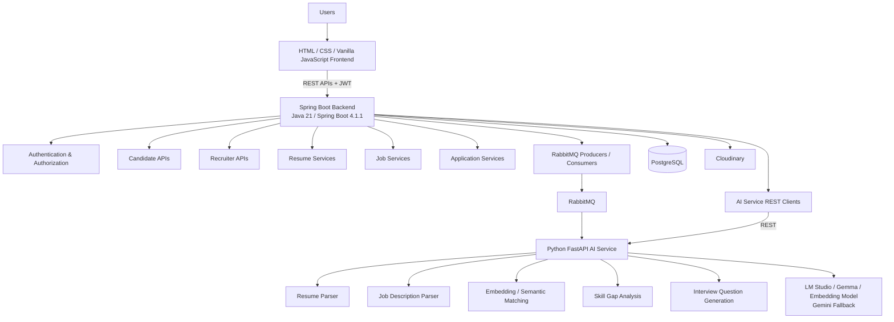
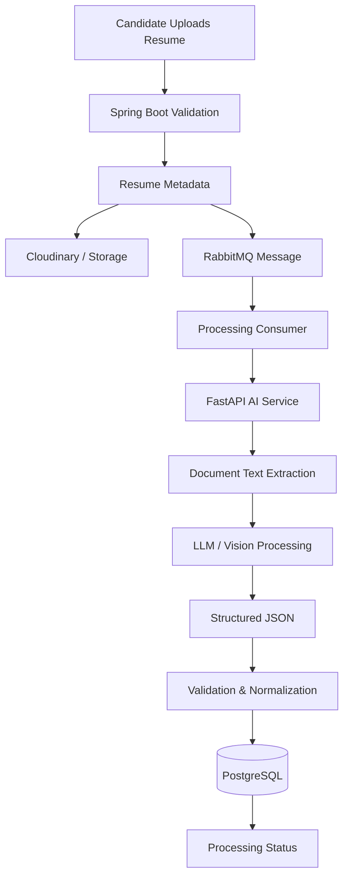
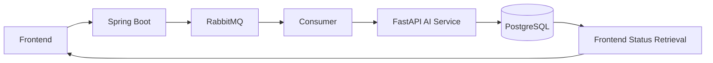
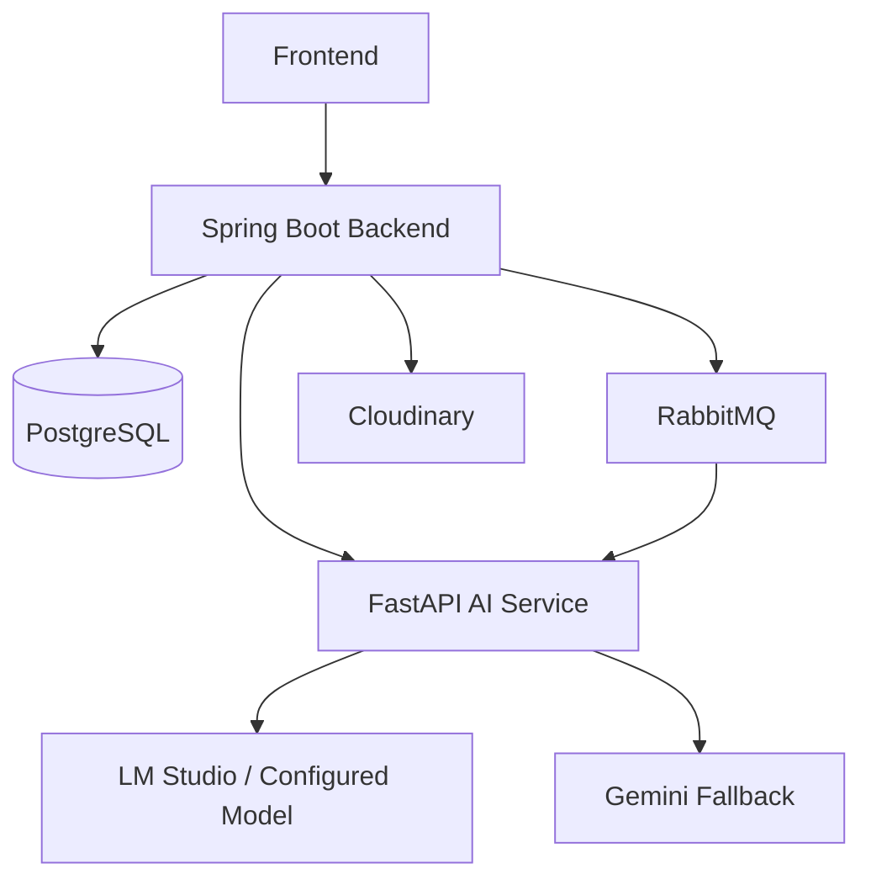

# NexHire — AI-Powered Resume Screening, Job Matching and Career Assistance Platform

[](https://www.oracle.com/java/)
[](https://spring.io/projects/spring-boot)
[](https://www.python.org/)
[](https://fastapi.tiangolo.com/)
[](https://www.postgresql.org/)
[](https://www.rabbitmq.com/)
[](https://www.docker.com/)
[](https://github.com/)

NexHire is a two-sided recruitment platform that connects **candidates and recruiters** through resume understanding, job-description analysis, semantic candidate-job matching, skill-gap analysis, interview-question generation, and application management.

NexHire combines a traditional full-stack web application with asynchronous processing and a dedicated Python-based AI service to transform unstructured recruitment documents into structured information and decision-support insights.

> **Important:** NexHire is a **decision-support platform, not an autonomous hiring system**. AI-generated results should be reviewed by humans before making recruitment or hiring decisions.

---

## Table of Contents

1. [Overview](#1-overview)
2. [Key Value Proposition](#2-key-value-proposition)
3. [Key Features](#3-key-features)
4. [User Roles](#4-user-roles)
5. [System Architecture](#5-system-architecture)
6. [End-to-End Workflow](#6-end-to-end-workflow)
7. [Resume Processing Pipeline](#7-resume-processing-pipeline)
8. [Resume Parser](#8-resume-parser)
9. [Job-Description Parser](#9-job-description-parser)
10. [Semantic Matching Engine](#10-semantic-matching-engine)
11. [Skill-Gap Analysis](#11-skill-gap-analysis)
12. [Interview Question Generation](#12-interview-question-generation)
13. [Asynchronous Processing with RabbitMQ](#13-asynchronous-processing-with-rabbitmq)
14. [Technology Stack](#14-technology-stack)
15. [Security](#15-security)
16. [Database Design](#16-database-design)
17. [API Architecture](#17-api-architecture)
18. [API Examples](#18-api-examples)
19. [Project Structure](#19-project-structure)
20. [Local Development](#20-local-development)
21. [Running the Project](#21-running-the-project)
22. [Docker and Deployment](#22-docker-and-deployment)
23. [Live Links](#23-live-links)
24. [Demo Workflow](#24-demo-workflow)
25. [Screenshots](#25-screenshots)
26. [Team](#26-team)
27. [Project Status](#27-project-status)
28. [Limitations](#28-limitations)
29. [Responsible AI](#29-responsible-ai)
30. [Future Enhancements](#30-future-enhancements)
31. [Academic and Engineering Highlights](#31-academic-and-engineering-highlights)
32. [Why NexHire Is Technically Interesting](#32-why-nexhire-is-technically-interesting)
33. [License](#33-license)

---

# 1. Overview

Traditional recruitment workflows often rely heavily on manual resume screening and keyword-based filtering. This can make it difficult to identify semantically relevant candidates when the terminology used in a resume differs from the terminology used in a job description.

**NexHire** addresses this problem by combining:

* Resume understanding
* Job-description analysis
* Structured information extraction
* Semantic candidate-job matching
* Skill-gap analysis
* Interview-question generation
* Recruiter-side applicant ranking
* Candidate application tracking

The platform follows a pipeline in which unstructured recruitment documents are converted into structured information, normalized, semantically represented, compared against job requirements, and presented as explainable decision-support information.

### Core Concept

```text
Unstructured Resume / Job Description
                │
                ▼
        Information Extraction
                │
                ▼
      Normalized Structured Data
                │
                ▼
       Semantic Representation
                │
                ▼
          Candidate Matching
                │
                ▼
       Explainable Results
                │
                ▼
     Actionable Recommendations
```

NexHire does **not** attempt to make autonomous hiring decisions. Matching scores and AI-generated information are intended to assist candidates, recruiters, and human evaluators.

---

# 2. Key Value Proposition

## For Candidates

NexHire provides candidates with tools to:

* Upload and parse resumes
* Build a structured candidate profile
* Discover relevant jobs
* Understand matched skills
* Identify missing skills
* Analyze role-specific skill gaps
* Generate role-specific interview questions
* Apply for jobs
* Track application status

## For Recruiters

NexHire enables recruiters to:

* Create job postings using natural-language descriptions
* Automatically analyze job requirements
* View applicants
* Compare candidate-job relevance
* Inspect matched and missing skills
* Review match explanations
* Download candidate resumes
* Manage application status

---

# 3. Key Features

## Authentication and User Management

| Feature                  | Description                                                               |
| ------------------------ | ------------------------------------------------------------------------- |
| Candidate Registration   | Candidate account creation                                                |
| Recruiter Registration   | Recruiter account creation                                                |
| Login                    | Authenticated access for both roles                                       |
| JWT Authentication       | Stateless API authentication                                              |
| Password Hashing         | Secure password storage through Spring Security                           |
| Role-Based Authorization | Candidate and recruiter access separation                                 |
| Ownership Validation     | Users can access resources according to ownership and authorization rules |

## Candidate Features

* Resume upload
* Resume processing
* Structured profile extraction
* Job discovery
* Job application
* Candidate-job match analysis
* Skill-gap analysis
* Interview-question generation
* Application tracking

## Recruiter Features

* Job creation
* Job-description processing
* Job management
* Applicant listing
* Candidate ranking
* Match explanations
* Resume download
* Application status management

## AI Capabilities

NexHire exposes five major AI capabilities:

1. **Resume Parser**
2. **Job-Description Parser**
3. **Resume-to-Job Semantic Matcher**
4. **Skill-Gap Analyzer**
5. **Interview-Question Generator**

These are **five AI capabilities/services of the platform, not five completely different LLMs**.

The underlying AI stack can use configured language and embedding models depending on the deployment environment.

---

# 4. User Roles

NexHire has two primary application roles.

| Role      | Primary Responsibilities                                                                              |
| --------- | ----------------------------------------------------------------------------------------------------- |
| Candidate | Manage profile, upload resume, discover jobs, analyze compatibility, apply and prepare for interviews |
| Recruiter | Create jobs, analyze requirements, review applicants, compare candidates and manage applications      |

The backend enforces role-based authorization and ownership checks before protected operations are performed.

---

# 5. System Architecture

NexHire follows a layered architecture separating the web interface, business logic, persistence, asynchronous processing, and AI operations.



## Architectural Layers

### Frontend Layer

The frontend is implemented using:

* HTML
* CSS
* Vanilla JavaScript
* Lucide icons

It communicates with the Spring Boot backend through REST APIs and handles authentication state, candidate workflows, recruiter workflows, and presentation of AI-generated results.

### Backend Layer

The Spring Boot backend acts as the primary application server.

Responsibilities include:

* Authentication
* Authorization
* User management
* Profile management
* Resume metadata
* File operations
* Job management
* Applications
* Database persistence
* RabbitMQ orchestration
* Communication with the AI service

### Messaging Layer

RabbitMQ is used for asynchronous processing operations such as resume and job-description processing.

### AI Layer

The Python FastAPI service provides document-processing and AI capabilities separately from the main application backend.

### Persistence Layer

PostgreSQL stores application data and structured results.

### File Storage Layer

Cloudinary is used for file storage and media handling.

### Model Layer

AI processing can use configured models served through LM Studio, with Gemini available as a configured fallback.

---

# 6. End-to-End Workflow

## Candidate Workflow


### Candidate Flow

1. Candidate opens the NexHire application.
2. Candidate creates an account or logs in.
3. Candidate uploads a resume.
4. Spring Boot validates and records the upload.
5. The file is stored through the configured storage service.
6. A processing message is published through RabbitMQ.
7. The AI processing workflow parses the document.
8. Structured resume information is produced.
9. Parsed data is persisted in PostgreSQL.
10. Candidate can discover available jobs.
11. Candidate can inspect job-specific match information.
12. Candidate can apply for jobs.
13. Candidate can analyze skill gaps.
14. Candidate can generate role-specific interview questions.

---

## Recruiter Workflow

```mermaid
flowchart LR
    A[Recruiter Signup / Login]
    A --> B[Create Job]
    B --> C[Store Job]
    C --> D[RabbitMQ Processing]
    D --> E[FastAPI JD Parser]
    E --> F[Structured Requirements]
    F --> G[(PostgreSQL)]
    G --> H[Applicant Collection]
    H --> I[Candidate Matching]
    I --> J[Ranking]
    J --> K[Match Explanation]
    K --> L[Resume Review]
    L --> M[Application Status]
```



### Recruiter Flow

1. Recruiter creates an account or logs in.
2. Recruiter creates a job posting.
3. The job description is stored.
4. Job-description processing is triggered.
5. The AI service extracts structured requirements.
6. Parsed requirements are persisted.
7. Applicants are collected for the job.
8. Candidate-job matching is performed.
9. Applicants can be presented according to the resulting matching information.
10. Recruiter reviews matched and missing skills.
11. Recruiter can inspect candidate information and download resumes.
12. Recruiter can update application status.

---

# 7. Resume Processing Pipeline

The resume-processing pipeline separates file handling, asynchronous processing, document extraction, AI analysis, validation, and persistence.



## Processing Steps

1. Candidate uploads a resume.
2. Frontend sends a `multipart/form-data` request.
3. Spring Boot validates the request.
4. Resume metadata is stored.
5. The file is stored using Cloudinary/storage infrastructure.
6. RabbitMQ publishes a processing message.
7. A consumer triggers AI processing.
8. FastAPI identifies and processes the document.
9. Text extraction is performed.
10. Scanned documents may require page rendering and vision/image processing.
11. AI extracts structured candidate information.
12. JSON/schema validation is applied.
13. Extracted data is normalized.
14. Parsed information is persisted in PostgreSQL.
15. The frontend can retrieve processing status.

## Supported Formats

The current implementation supports processing for:

* PDF
* JPG/JPEG
* TXT
* DOCX support in the AI service

Different file formats can follow different extraction paths. They should not be assumed to use an identical processing pipeline.

---

# 8. Resume Parser

The resume parser converts unstructured candidate documents into structured information.

Typical extracted information includes:

* Name
* Email
* Phone
* Skills
* Education
* Experience
* Projects
* Certifications
* Links
* Years of experience

## Parser Characteristics

The processing pipeline supports:

* Skill normalization
* Duplicate removal
* Context-aware extraction
* Confidence values where available
* Structured JSON output
* Validation of generated information
* Avoidance of unsupported or invented skills

## Technologies

The resume-processing stack can include:

* PyMuPDF
* `python-docx`
* Pillow/image processing where required
* LLM/vision processing
* JSON validation

## Representative Output

The following is an **illustrative structure**, not a guaranteed production API response:

```json
{
  "name": "Candidate Name",
  "email": "candidate@example.com",
  "skills": [
    "Java",
    "Spring Boot",
    "PostgreSQL"
  ],
  "education": [
    {
      "degree": "B.Tech",
      "field": "Computer Science"
    }
  ],
  "experience": [],
  "projects": [],
  "certifications": [],
  "links": [],
  "yearsOfExperience": 0
}
```

The exact production schema should be determined from the deployed AI-service contract.

---

# 9. Job-Description Parser

Recruiters can provide job descriptions as natural or plain text.

The AI service analyzes the description and extracts structured requirements such as:

* Job title
* Required experience
* Education requirements
* Skills
* Skill importance
* Skill category
* Normalized skill names

## Skill Importance

Requirements can be classified as:

| Importance | Meaning               |
| ---------- | --------------------- |
| HIGH       | Core requirement      |
| MEDIUM     | Important requirement |
| LOW        | Preferred requirement |

## Skill Categories

Depending on the parsed job description, skills can be categorized as:

* Technical
* Tool
* Soft Skill
* Domain

Normalization and importance classification allow downstream matching to distinguish between core requirements and preferred requirements rather than treating every keyword equally.

---

# 10. Semantic Matching Engine

NexHire compares structured job requirements against structured candidate information.

When configured, the matching pipeline uses semantic embeddings to identify relationships between skills even when the terminology is not exactly identical.

## Embedding Configuration

When configured:

* **Qwen3-Embedding-0.6B** is served through **LM Studio**.
* Embeddings are generated for semantic comparison.
* Cosine similarity measures semantic closeness.
* Skill importance affects weighting.
* Candidate confidence can contribute to matching.
* Experience requirements can act as eligibility gates.

## Fallback Matching

If embedding-based matching is unavailable, normalized skill-name comparison can be used as a fallback.

## Current Scoring Formulation

The current internal scoring formulation is:

```text
Overall Score =
85% Weighted Skill Score
+
15% Experience Surplus Score
```

This score is an **internal decision-support metric**.

It should not be interpreted as:

* An objective measurement of candidate quality
* A prediction of job performance
* A hiring decision
* A substitute for recruiter judgment
* A complete representation of candidate suitability

The quality of the result depends on the quality of the extracted, normalized, and configured data.

---

# 11. Skill-Gap Analysis

NexHire provides job-specific feedback by comparing candidate capabilities against job requirements.

The analysis can identify:

* Matched skills
* Missing skills
* High-priority missing skills
* Medium-priority missing skills
* Preferred missing skills
* Experience requirement status
* Human-readable explanations

### Illustrative Example

> You match the role in Java and SQL, but should strengthen Spring Boot, Docker and cloud deployment.

The above is an illustrative example rather than a guaranteed production response.

Skill-gap analysis is intended to help candidates understand where their profile differs from a particular job's requirements.

---

# 12. Interview Question Generation

NexHire can generate role-specific interview questions based on:

* Job title
* Parsed job requirements
* Relevant technical skills
* Role context

Questions can cover:

* Technical topics
* Scenario-based questions
* Experience-based questions
* Behavioral questions

The feature is intended to support **candidate interview preparation**.

It does not replace human interviewers or determine whether a candidate should be hired.

---

# 13. Asynchronous Processing with RabbitMQ

Resume processing and job-description analysis can involve operations that should not block normal HTTP request handling.

NexHire uses RabbitMQ to separate application requests from longer-running processing workflows.

## Processing Architecture



## Reasons for Asynchronous Processing

RabbitMQ helps provide:

* Separation between request handling and processing
* Loosely coupled backend and AI services
* Processing status tracking
* Retry-oriented processing workflows
* More responsive API interactions

No specific throughput or latency benchmark is claimed.

---

# 14. Technology Stack

| Layer               | Technologies                                           |
| ------------------- | ------------------------------------------------------ |
| Frontend            | HTML, CSS, Vanilla JavaScript, Lucide Icons            |
| Backend             | Java 21, Spring Boot 4.1.1                             |
| Web/API             | Spring Web, REST APIs                                  |
| Persistence         | Spring Data JPA, PostgreSQL                            |
| Security            | Spring Security, JWT                                   |
| Database Migration  | Flyway                                                 |
| Messaging           | RabbitMQ                                               |
| AI Service          | Python, FastAPI                                        |
| Document Processing | PyMuPDF, `python-docx`, Pillow/image processing        |
| Model Serving       | LM Studio                                              |
| Main LLM            | Google Gemma 4 E4B                                     |
| Embeddings          | Qwen3-Embedding-0.6B through LM Studio when configured |
| AI Fallback         | Gemini 3.1 Flash-Lite or configured Gemini model       |
| File Storage        | Cloudinary                                             |
| Containerization    | Docker                                                 |
| Networking          | Tailscale/private networking where required            |
| Version Control     | Git, GitHub                                            |

### Deliberate Architecture Choice

NexHire does **not** use five independent LLMs.

The five AI capabilities represent application-level services:

1. Resume parsing
2. Job-description parsing
3. Semantic matching
4. Skill-gap analysis
5. Interview-question generation

Different capabilities can use configured model components and processing logic within the AI service.

---

# 15. Security

Security is implemented across authentication, authorization, data access, file handling, and service communication.

## Application Security

NexHire uses:

* Spring Security
* JWT authentication
* Password hashing
* Role-based authorization
* Candidate ownership validation
* Recruiter ownership validation
* File validation
* Structured JSON validation
* Error handling

## Internal AI-Service Security

Where configured, communication with the internal AI service can be protected using:

```text
X-AI-Service-Key
```

The AI service can also be isolated through private networking where required.

## Secrets Management

Sensitive configuration must never be committed to GitHub.

Examples include:

* Database credentials
* JWT secrets
* Cloudinary API credentials
* RabbitMQ credentials
* AI service keys
* Gemini API keys
* Other private credentials

Use environment variables or an appropriate secret-management mechanism.

For local development, `.env` files may be used where supported.

> **Never commit `.env` files or real credentials to the repository.**

---

# 16. Database Design

PostgreSQL is the primary relational database for NexHire.

The application uses Flyway for version-controlled database schema migrations.

## Major Conceptual Entities

```text
User
 │
 ├── CandidateProfile
 │
 └── RecruiterProfile

Candidate
 │
 └── Resume
       │
       └── ResumeParsedData

Recruiter
 │
 └── Job
       │
       └── JobParsedData

Candidate + Job
 │
 └── JobApplication
       │
       ├── SkillGapResult
       └── InterviewQuestion
```

Major conceptual entities include:

* `User`
* `Role`
* `CandidateProfile`
* `RecruiterProfile`
* `Resume`
* `ResumeParsedData`
* `Job`
* `JobParsedData`
* `JobApplication`
* `SkillGapResult`
* `InterviewQuestion`

The exact database schema should be treated as the source of truth for implementation-level column definitions.

## Flyway

Database schema changes are managed through versioned Flyway migrations.

This allows the schema to evolve in a controlled and reproducible manner across development and deployment environments.

---

# 17. API Architecture

The frontend communicates with the Spring Boot backend through REST APIs under:

```text
/api/v1/...
```

## Spring Boot Responsibilities

The backend owns:

* Authentication
* Authorization
* User management
* Candidate profiles
* Recruiter profiles
* Resume metadata
* File operations
* Job management
* Applications
* Database persistence
* Backend orchestration

## AI Service Responsibilities

The FastAPI service handles AI-oriented operations such as:

```text
/ai/v1/parse-resume-file
/ai/v1/analyze-jd
/ai/v1/match
/ai/v1/skill-gap
/ai/v1/interview-questions
```

Spring Boot communicates with FastAPI through REST.

The AI service is intended to remain an internal service and may be protected using:

```text
X-AI-Service-Key
```

---

# 18. API Examples

The examples below are intentionally illustrative. Exact request and response contracts should be verified against the implementation before using them as integration contracts.

## Spring Boot API

```http
POST /api/v1/...
Authorization: Bearer <JWT>
Content-Type: application/json
```

Example request structure:

```json
{
  "example": "request body"
}
```

## AI Service API

```http
POST /ai/v1/match
X-AI-Service-Key: <configured-key>
Content-Type: application/json
```

Illustrative request:

```json
{
  "candidate": {},
  "job": {}
}
```

Illustrative response:

```json
{
  "match": {},
  "explanation": {}
}
```

These examples are placeholders and should not be interpreted as guaranteed production contracts.

---

# 19. Project Structure

The repository structure should be kept consistent with the actual implementation.

A representative organization is:

```text
NexHire/
├── frontend/
├── backend/
│   ├── src/
│   ├── pom.xml
│   └── Dockerfile
├── ai-service/
│   ├── app/
│   ├── requirements.txt
│   └── Dockerfile
├── docs/
├── .gitignore
└── README.md
```

> **Note:** This is a representative structure. Directory names and locations should be adjusted to match the actual repository structure rather than assumed to exist.

---

# 20. Local Development

## Prerequisites

Install the following before running NexHire locally:

* Java 21
* Maven
* Python
* PostgreSQL
* RabbitMQ
* Cloudinary account/configuration
* Git
* Docker, if containerized execution is preferred
* LM Studio if local model serving is required

## Environment Configuration

Create a local environment configuration containing values similar to:

```env
DATABASE_URL=
DATABASE_USERNAME=
DATABASE_PASSWORD=

JWT_SECRET=

CLOUDINARY_CLOUD_NAME=
CLOUDINARY_API_KEY=
CLOUDINARY_API_SECRET=

RABBITMQ_HOST=
RABBITMQ_PORT=

AI_SERVICE_URL=
AI_SERVICE_KEY=
```

Additional environment variables may be required by the actual implementation.

### Security Notice

Do not commit:

```text
.env
.env.*
*.pem
*.key
```

or any file containing private credentials.

Use `.gitignore` and deployment-specific secret configuration to keep credentials outside source control.

---

# 21. Running the Project

A generic local startup sequence is:

### 1. Clone the repository

```bash
git clone https://github.com/Diyali14/NexHire.git
cd NexHire
```

### 2. Configure environment variables

Set the required database, JWT, Cloudinary, RabbitMQ, and AI-service configuration.

### 3. Start PostgreSQL

Ensure PostgreSQL is running and the configured database is accessible.

### 4. Start RabbitMQ

Ensure RabbitMQ is running and reachable using the configured host and port.

### 5. Configure Cloudinary

Configure the required Cloudinary credentials through environment variables.

### 6. Start the AI Service

Start the FastAPI service according to the actual AI-service project structure and dependency configuration.

### 7. Start LM Studio if required

If local model serving is enabled, start the required model configuration through LM Studio.

### 8. Start Spring Boot

Run the backend using the repository's configured Maven workflow.

For example:

```bash
mvn spring-boot:run
```

### 9. Start the Frontend

Serve the frontend according to the actual frontend structure.

Because the frontend uses HTML, CSS, and Vanilla JavaScript, the exact command depends on how the repository serves the static files.

### 10. Open the Application

Open the configured frontend URL in a browser.

> Exact development commands should follow the repository's current configuration and deployment setup.

---

# 22. Docker and Deployment

NexHire can use Docker for packaging backend and service components.

A high-level deployment architecture is:



Potential deployment responsibilities:

* Frontend serves the web interface.
* Spring Boot provides application APIs.
* PostgreSQL stores application data.
* RabbitMQ manages asynchronous processing.
* Cloudinary handles configured file storage.
* FastAPI provides AI operations.
* LM Studio can provide locally or privately hosted model inference.
* Gemini can act as a configured fallback.

The actual infrastructure may distribute these components across different services or hosts.

### Backend Deployment

Current backend deployment reference:

```text
https://nexhire-backend-5zv7.onrender.com
```

### Private Networking

Tailscale/private networking may be used where required to keep internal AI-service communication away from public exposure.

NexHire does not claim that every component is deployed on the same infrastructure.

---

# 23. Live Links

## GitHub

https://github.com/Diyali14/NexHire

## Live Application

https://nex-hire-resume-matcher.vercel.app/

## Backend API

https://nexhire-backend-5zv7.onrender.com

## API Documentation

https://nex-hire-resume-matcher.vercel.app/

Only expose API documentation here if Swagger/OpenAPI is actually enabled and publicly accessible.

Private AI-service URLs and credentials should not be exposed in this section.

---

# 24. Demo Workflow

The following workflow can be used for an academic project evaluation or technical demonstration.

## Candidate Demo

1. Open the landing page.
2. Log in as a candidate.
3. Upload a sample resume.
4. Show resume-processing status.
5. Show the parsed candidate profile.
6. Search available jobs.
7. Open a job.
8. Show candidate-job match information.
9. Show the skill-gap analysis.
10. Generate interview questions.
11. Submit an application.
12. Show application tracking.

## Recruiter Demo

1. Log in as a recruiter.
2. Create a job.
3. Show job-description processing.
4. Open the applicant list.
5. Review candidate matching information.
6. Inspect the match explanation.
7. Open a candidate profile.
8. Download the resume.
9. Update the application status.

---

# 25. Screenshots

Screenshots can be stored under:

```text
docs/screenshots/
```

Will be added later

---

# 26. Team

| Team Member             | Contributions                                                                                                                              |
| ----------------------- | ------------------------------------------------------------------------------------------------------------------------------------------ |
| **Diyali Mukherjee**    | Spring Boot backend, REST APIs, Authentication, Database integration, RabbitMQ integration, Backend orchestration, Server-side integration |
| **Soham Jana**         | FastAPI AI service, Model integration, Resume/JD parsing, Semantic matching, Skill-gap analysis, Interview-question generation             |
| **Soumi Sahu**         | Recruiter-side frontend                                                                                                                    |
| **Nandini Sethi**      | Recruiter-side frontend                                                                                                                    |
| **Kaushik Debnath**     | Candidate-side frontend                                                                                                                    |
| **Ritesh Kumar Pathak** | Candidate-side frontend                                                                                                                    |

---

# 27. Project Status

## Current Implementation

The current implementation includes:

* Candidate authentication
* Recruiter authentication
* JWT-based authorization
* Resume processing
* Job creation
* AI parsing
* Semantic matching
* Skill-gap analysis
* Interview-question generation
* Candidate applications
* Recruiter applicant management
* Backend deployment
* Asynchronous processing through RabbitMQ
* PostgreSQL persistence
* Cloudinary-based file storage

The platform is suitable for academic demonstration, technical evaluation, portfolio presentation, and continued development.

The project should **not** be interpreted as claiming complete production readiness or autonomous recruitment capability.

---

# 28. Limitations

NexHire has several practical limitations that are important when interpreting its results.

* Resume formatting can affect extraction quality.
* Scanned documents may require additional vision/OCR processing.
* AI-generated information may contain errors.
* Semantic similarity is not a complete measure of candidate suitability.
* Matching scores depend on extracted and normalized data.
* Embedding availability depends on model configuration.
* Hiring decisions should not be fully automated.
* Candidate personal information requires secure handling.
* Model outputs require validation and human review.
* Different document formats can require different processing pipelines.
* AI model behavior can vary depending on model configuration and input quality.

---

# 29. Responsible AI

## Human-in-the-Loop

NexHire provides decision support rather than autonomous hiring decisions.

Recruiters should review candidate information, resumes, requirements, and AI-generated results before making employment decisions.

## Explainability

The platform can expose information such as:

* Matched skills
* Missing skills
* Skill importance
* Experience-related information
* Human-readable matching explanations

This allows users to inspect some of the factors contributing to the decision-support output.

## Data Privacy

Candidate resumes and personal information must be protected through:

* Secure storage
* Controlled access
* Authentication
* Authorization
* Appropriate credential management
* Secure service communication

## Bias Awareness

Semantic matching does not guarantee fairness.

AI-assisted recruitment systems can still reflect biases originating from:

* Training data
* Job descriptions
* Resume data
* Extraction errors
* Model behavior
* Matching methodology

Bias evaluation and monitoring remain important areas for continued development.

## AI Reliability

AI-generated information should be treated as potentially incomplete or incorrect.

Human review remains necessary, particularly for employment-related decisions.

---

# 30. Future Enhancements

The following are future enhancements rather than claims about the current implementation:

* Multi-language resume support
* Improved OCR for scanned documents
* Recruiter analytics dashboard
* Email and notification system
* Calendar and interview scheduling
* Candidate feedback loop
* Bias and fairness monitoring
* Model evaluation dashboard
* Human-in-the-loop screening workflows
* Resume improvement suggestions
* Skill-learning recommendations
* Additional embedding models
* Model versioning
* A/B testing
* Kubernetes/container orchestration
* Audit logging
* Stronger privacy controls

---

# 31. Academic and Engineering Highlights

NexHire demonstrates several software engineering and AI engineering concepts:

* Full-stack application architecture
* RESTful API design
* JWT authentication
* Role-based authorization
* Relational database design
* Database migrations
* Asynchronous messaging
* Event-driven processing
* AI-service integration
* Semantic embeddings
* LLM integration
* File processing
* Structured data extraction
* Service separation
* Containerization
* Deployment
* Git/GitHub collaboration

The project demonstrates how conventional application architecture can be combined with document-processing and AI services without placing all application responsibilities inside a single service.

---

# 32. Why NexHire Is Technically Interesting

The primary engineering challenge in NexHire is the transformation of unstructured recruitment information into structured, comparable and actionable information.

The core pipeline is:

```text
Unstructured Documents
        │
        ▼
Information Extraction
        │
        ▼
Normalized Structured Data
        │
        ▼
Semantic Representation
        │
        ▼
Candidate-Job Matching
        │
        ▼
Explainable Results
        │
        ▼
Actionable Recommendations
```

This requires coordination between multiple technical layers:

* A browser-based frontend
* A Java/Spring Boot backend
* Relational database persistence
* Secure authentication
* File storage
* RabbitMQ-based asynchronous processing
* A Python/FastAPI AI service
* Document parsing
* LLM processing
* Embedding-based semantic comparison
* Structured output validation
* Deployment infrastructure

Therefore, NexHire is not simply a CRUD recruitment application. It combines **full-stack development, distributed service communication, asynchronous processing, document processing, and AI-assisted analysis** within a single application workflow.

---

# 33. License

License information will be added here.
